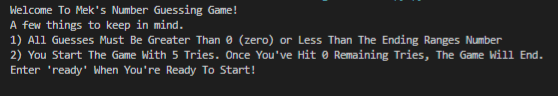
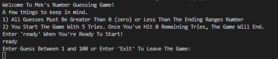
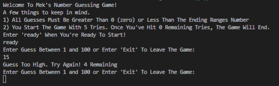
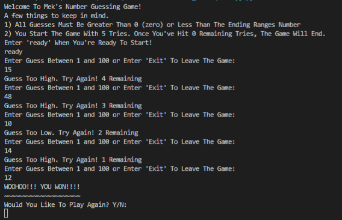
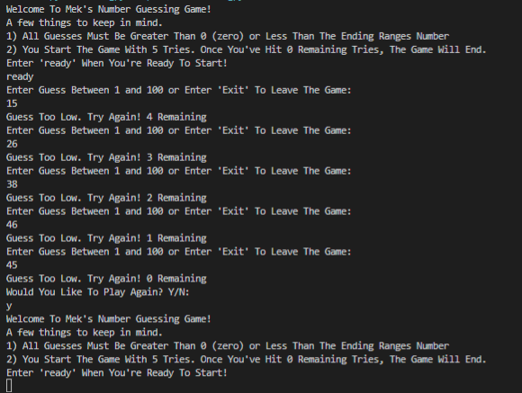

<h1>Mek's Number Guess Game</h1>

    The <code>main.py</code> file is all you need for playing the game as it runs right in your command prompt window! You get 5 tries to start, and you have to guess the winning number between 1 and 100!

<h1>Getting Started</h1>

    <h2>To get started:</h2>
    <ul>
        <li>Windows 10 or 11:
            <ul>
                <li>
                    Press the windows key and the 'r' key at the same time. This will bring up a dialog box in the bottom left-hand cornor of your screen. In this dialog box, type <code>cmd</code> and press enter. In the new window, type:
                    <ul>
                        <li><code>cd Desktop</code> or to a directory of your choosing. Remember Where you put it!</li>
                        <li><code>git clone 'https://github.com/mekasu0124/Meks-Number-Guessing-Game.git'</code></li>
                        <li><code>cd Meks-Number-Guessing-Game</code></li>
                        <li><code>python main.py</code></li>
                    </ul>
                </li>
            </ul>
        </li>
        <li>Linux:
            <ul>
                <li>
                    Open your terminal. You should be able to open your system tray, type <code>terminal</code> in the search bar, and press enter on the first option.
                    Once you're terminal is open, type:
                    <ul>
                        <li><code>cd Desktop</code> or to a directory of your choosing. Remember where you put it!</li>
                        <li><code>git clone 'https://github.com/mekasu0124/Meks-Number-Guessing-Game.git'</code></li>
                        <li><code>cd Meks-Number-Guessing-Game</code></li>
                        <li><code>python main.py</code></li>
                    </ul>
                </li>
            </ul>
        </li>
        <li>Troubleshooting:
            <ul>
                <li>
                    If you get an error that
                    <a href="https://docs.github.com/en/repositories/creating-and-managing-repositories/troubleshooting-cloning-errors">
                        git cannot clone the repository
                    </a>
                    or
                    <a href="https://stackoverflow.com/questions/19290899/git-is-not-installed-or-not-in-the-path">
                        git isn't installed
                    </a>.
                </li>
                <li>
                    If you get an error that
                    <a href="https://realpython.com/run-python-scripts/">
                        python cannot run the file
                    </a>
                    or
                    <a href="https://github.com/microsoft/vscode-python/issues/9576">
                        python is not installed
                    </a>
                </li>
                <li>
                    If all else fails, please <a href="https://discord.gg/95uVDay6TH">join the Gawther discord</a> for further assistance, or please submit an issue on the <a href="https://github.com/mekasu0124/Meks-Number-Guessing-Game/issues">
                        repo's issues page
                    </a> and please follow the following format:
                    <ul>
                        <li>
                            Template:
                            <ul>
                                <li>Subject:</li>
                                <li>Issue-In-Brief (3-5 sentences):</li>
                                <li>Code Link:</li>
                                <li>Screen Shot Link(s):</li>
                                <li>Full Details:</li>
                            </ul>
                        </li>
                    </ul>
                </li>
            </ul>
        </li>
    </ul>

<h2>How To Play:</h2>

    <ol>
        <li>
            <h3 style="color: orange;">Greetings</h3>
            
            

                When you run the <code>main.py</code> file, this will be the first thing to pop up in the terminal. This gives a small greeting, and a few reminders to get you started. When you're ready to begin the game, type <code>ready</code>.
            

        </li>
        <li>
            <h3 style="color: orange;">First Move</h3>
            
            

                After you've entered <code>ready</code> and the game starts, you'll be asked to pick a number between 1 and 100. If you enter a number that is less than 1 or greater than 100, or your guess is incorrect, then you lose a try. At anytime during your times of guessing that you're ready to quit the game, then simply type <code>Exit</code> and the game will prompt a confirmation.
            

        </li>
        <li>
            <h3 style="color: orange;">Getting The Guess Wrong</h3>
            
            
When you guess incorrectly, you will be decremented one "try" and asked for another guess.

        </li>
        <li>
            <h3 style="color: orange;">Winning The Game</h3>
            
            

                When you guess the number correctly and win the game, you'll see a winning message like the one in the image above. Great job! You Won!
            

        </li>
        <li>
            <h3 style="color: orange;">Losing The Game</h3>
            
            

                When you've run out of tries and the game comes to an end, you will be prompted to play again. Enter either <code>yes</code> or <code>no</code> to either restart the game, or end the game.
            

        </li>
    </ol>

<h2>Extra Information <strong>Programmers Only</strong></h2>

    <ol>
        <li>
            <code>self.comp_num = random.randint(1,100)</code> gives you the computers randomly chosen number to be the winning number to guess. This must always be a range unless you feel like re-writing the entire class.
        </li>
        <li>
            <code>def get_user_input(self):\ntries = 5</code> is where you set the number of tries the user gets per game.
        </li>
    </ol>

<h1>In Addition To</h1>

    In Absence Of A License For This Repository, I Am Writing My Own As Displayed Below. This Policy Is Subject To Change At Anytime And It Is Your Responsiblity To Keep Up With Said Changes, If Any.
    <ol>
        <li>You May
            <ul>
                <li>
                    You May Change The Range Of Which The Computers Randomly Chosen Winning Number To Which Ever Range You Like.
                </li>
                <li>
                    You May Change The Welcome Strings On Lines 12-17 In The List Array Belonging To <code>information = [. . .]</code> To Anything Of Your Choosing, But Are Not Allowed To Remove "Mek's Number Guessing Game", Edit "Mek's Number Guessing Game", or Add To "Mek's Number Guessing Game".
                </li>
                <li>
                    You May Create A Fork To The Repository In Attempts To Contribute To Mek's Number Guessing Game To Improve The Game As A Whole.
                </li>
            </ul>
        <li>
        <li>You May Not
            <ul>
                <li>
                    You May Not Add To, Change Of, Edit To Add or Remove Any Part Of "Mek's Number Guessing Game" Within Any Source Code, or Titles Within Any Files Inside Of or Belonging To Mek's Number Guessing Game.
                </li>
            </ul>
        </li>
    </ol>

